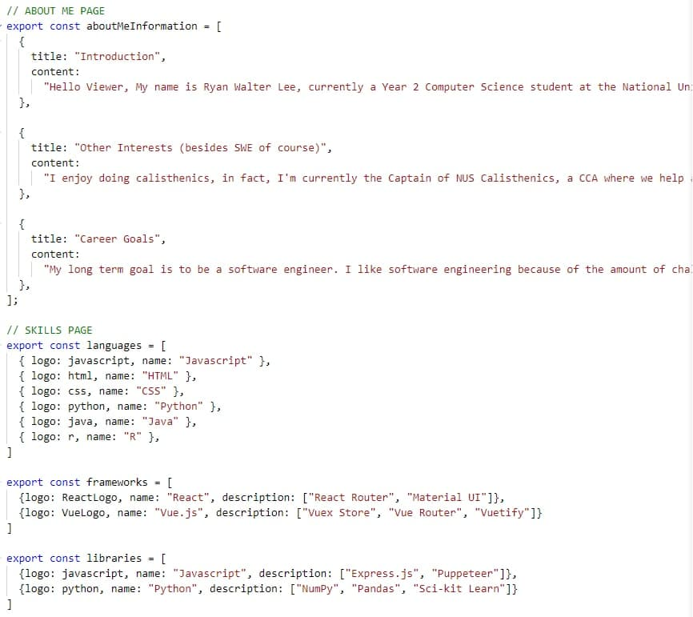

# Creator
created by: Ryan Walter Lee (not copied from another repo)

# Portfolio template guide
The code is structured and abstracted to the point that anyone with minimal react experience can edit and use this portfolio site.

All pages can be modified from inside a single file which is found in src/Information.js file. Note that some fields are compulsory and will not work if you choose to omit it.

## Steps to use the template
1. Clone the repository
2. run `npm i` to install dependencies
3. Go to src > Information.js
4. Edit your portfolio information
5. Deploy on github pages! (find a guide on how to deploy)

## Example of Information.js

Follow the format already there to add/change information

## Available Scripts

In the project directory, you can run:

### `npm start`

Runs the app in the development mode.\
Open [http://localhost:3000](http://localhost:3000) to view it in your browser.

The page will reload when you make changes.\
You may also see any lint errors in the console.

### `npm run build`

Builds the app for production to the `build` folder.\
It correctly bundles React in production mode and optimizes the build for the best performance.

The build is minified and the filenames include the hashes.\
Your app is ready to be deployed!

See the section about [deployment](https://facebook.github.io/create-react-app/docs/deployment) for more information.

